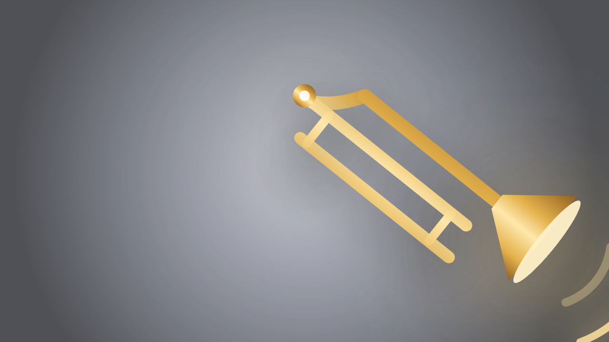
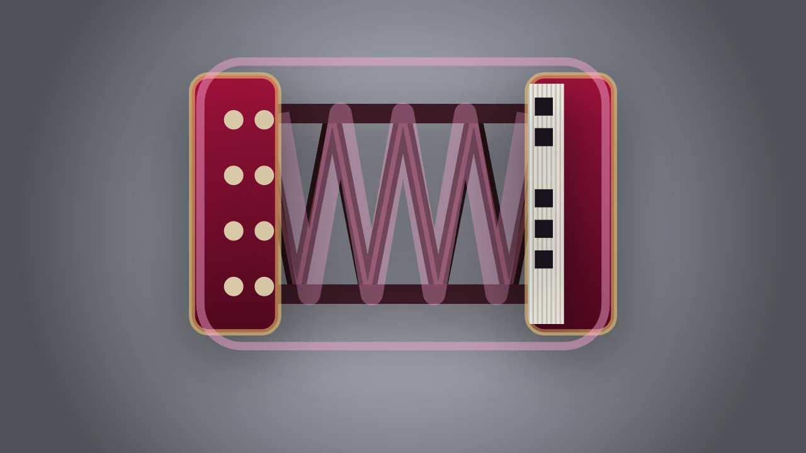
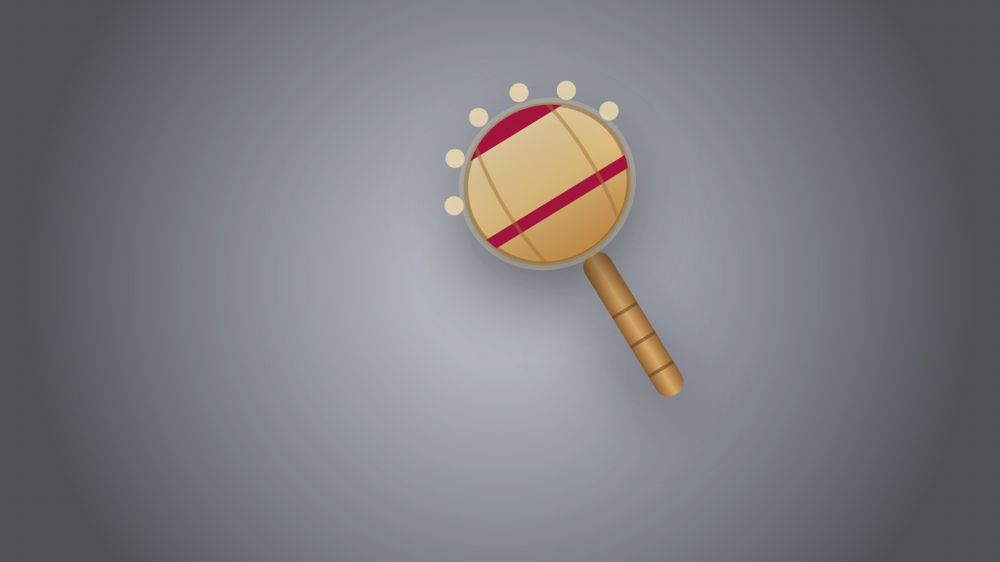

# 🎺🪗🥁🪇 Imaginary Instruments

Play invisible instruments with your body — right in the browser.

Your webcam tracks your face and hands; an instrument is drawn over the live
video and you play it for real: slide positions, bellows pumps, pitch and
volume all come from how you move. **No video ever leaves your device** — the
tracking models run locally via WebAssembly, and all sound is synthesized
live with the Web Audio API (no samples, no uploads, no server).

## The instruments



### 🎺 Air Trombone
The trombone hangs off your **mouth** and one **hand**.

- The mouth↔hand distance is the **slide position** — pull your hand away to
  go lower (B♭2 down to E♭2, continuous glide, just like a real slide).
- **Open your mouth to blow.** Wider open = louder. Close your lips and the
  sound stops.



### 🪗 Air Accordion
The accordion stretches between **both hands**.

- Hand separation picks the note (C-major pentatonic, C3–C5).
- The *speed* of your hands moving together/apart drives the **bellows** —
  you only hear sound while you're actually pumping, like the real thing.

### 🪇 Air Maracas
One maraca per hand — or grab just one.

- Every **shake** (a fast direction reversal of your hand) fires a rattle:
  a noise burst through a high bandpass, like beads slamming the gourd.
- Shake harder for louder, denser rattles; hold still and they settle.
  The maracas squash and throw beads with each hit.



### 🥁 Air Drums
A five-piece kit across the bottom of the frame.

- **Punch down into a pad** to strike it — kick, hi-hat, snare, tom, floor.
  Punch speed sets the velocity, like real sticking.
- A sharp **nod of your head** plays the kick drum (face tracking).
- Mouse mode: sweep the pointer down into a pad; hold click for the kick.

### 🎶 Air Harp
A harp hangs in the air below your face — both hands stay free.

- **All ten fingertips are plectra**: sweep a fingertip *across* a glowing
  string to pluck it. Sweep speed sets the volume.
- Real Karplus-Strong string synthesis (rendered per pitch and cached),
  so plucks genuinely ring and decay like strings.

## Controls

| Input | Action |
| --- | --- |
| `1`–`5` | switch instrument (trombone / accordion / maracas / drums / harp) |
| `D` | debug overlay (landmarks, slide/spread values) |
| `M` | mouse mode (no camera needed) |
| Mouse mode | move pointer = hand · hold click / `Space` = blow |
| 🔊 button | mute |

## Try it

Open the live demo (GitHub Pages) or run locally:

```bash
# any static server works — camera access requires https or localhost
python3 -m http.server 8000
# then visit http://localhost:8000
```

First load downloads the MediaPipe tracking models (~15 MB) — the download
starts the moment the page opens, so by the time you click "Start" the
camera comes up almost instantly. Models are cached for future visits.
Works best in Chrome/Edge/Safari on a desktop or laptop with a webcam.

## Performance

The app adapts to your machine. A quality governor watches the render fps
and steps between three tiers — trading canvas size, glow/shadow effects,
and face-inference rate — to keep the loop smooth; the `D` debug overlay
shows the current tier. Camera capture runs at 640×480 (plenty for
tracking), hands are detected every frame, and the face every other frame.
If the GPU tracker stalls on your browser, it automatically rebuilds on the
CPU and drops to the leanest tier (the status pill shows "· CPU").

## How it works

- **Tracking** — [MediaPipe Tasks Vision](https://developers.google.com/mediapipe)
  (`FaceLandmarker` + `HandLandmarker`) running per video frame on the GPU.
  The face supplies the mouth anchor, a jaw-open "blow" signal (from face
  blendshapes), and an eye-distance reference used to scale everything.
- **Mapping** — key points are exponentially smoothed, then mapped to
  instrument parameters measured in "eye widths" so the instrument keeps a
  consistent size as you lean in or out.
- **Sound** — synthesized from oscillators: the trombone is a pair of
  detuned sawtooths through a pitch-tracking lowpass (brass-ish) with
  vibrato; the accordion is a bank of detuned "reeds" (16′ sub, two musette
  reeds ±8¢, 4′ octave) whose volume follows bellows speed.
- **Overlay** — a 2D canvas layered exactly over the (mirrored) video draws
  the trombone/slide and the accordion with its folding bellows, scaling with
  your face.

## Project layout

```
index.html      — page shell, start panel, HUD
style.css       — all styling
src/main.js     — app state, input mapping, game loop
src/tracking.js — camera + MediaPipe wrappers
src/audio.js    — Web Audio synthesis (trombone & accordion voices)
src/draw.js     — canvas rendering of the instruments
```

## Privacy

Everything is client-side: the camera stream is never recorded or sent
anywhere, models are fetched once from Google's CDN, and the app works
offline after the first load (cache permitting).

## License

[MIT](LICENSE)
